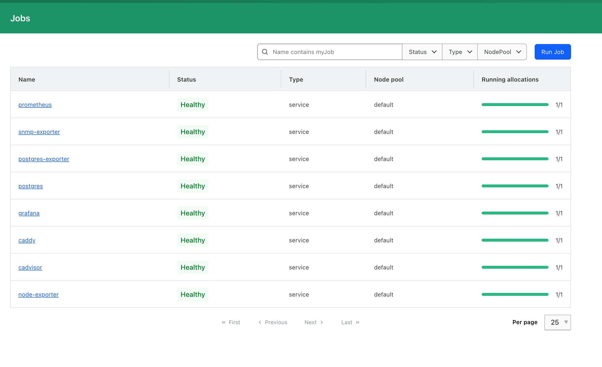
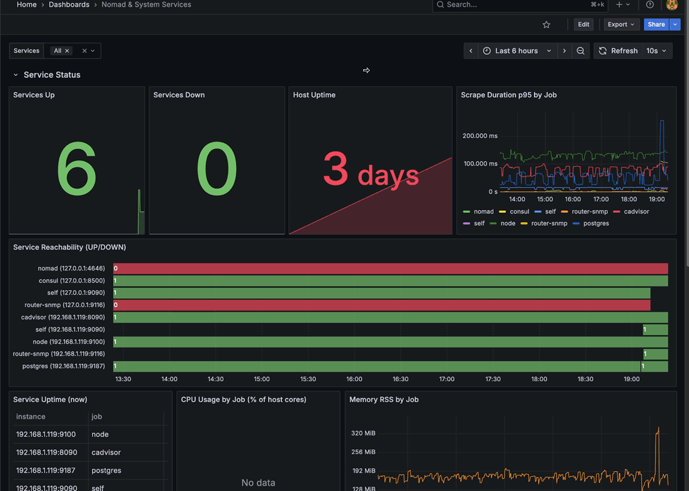
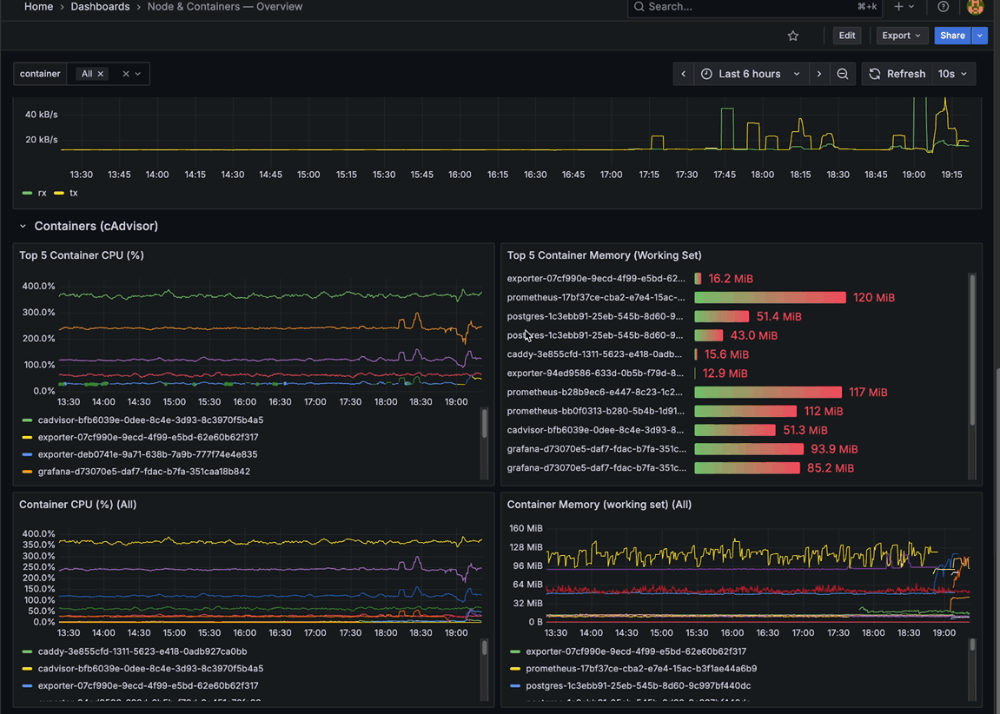
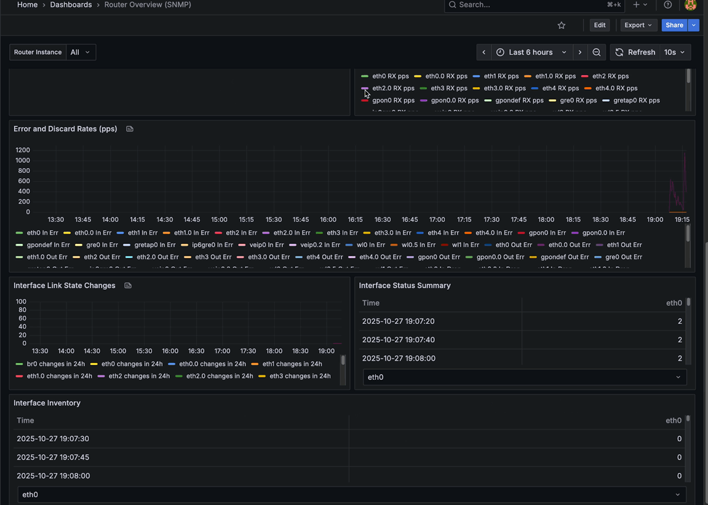
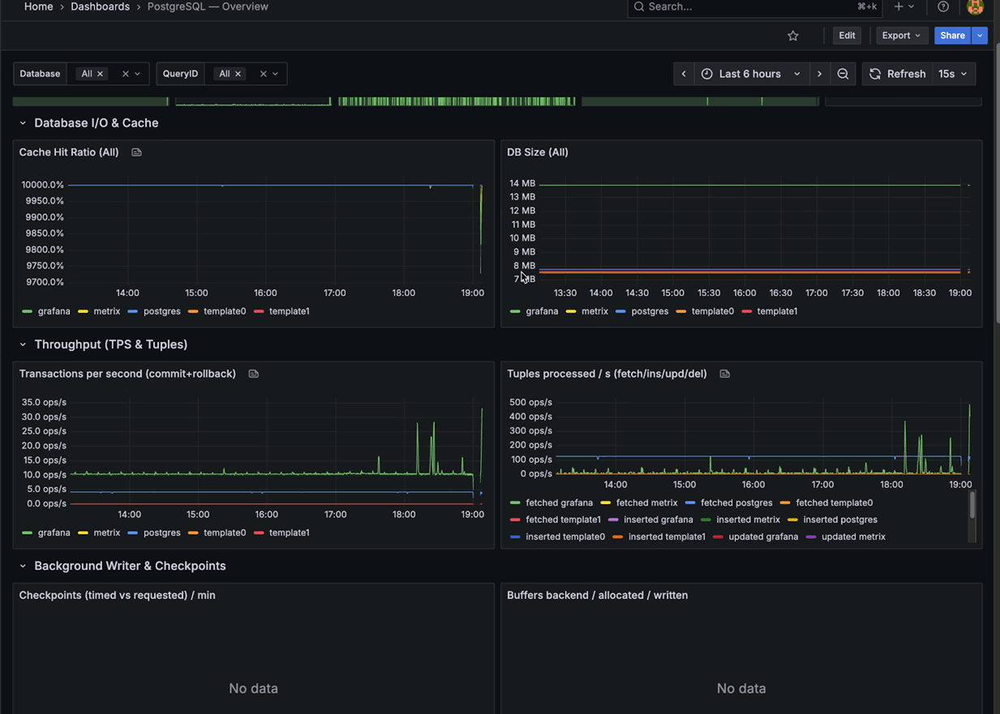

# NAS Infrastructure Automation

Hands-free provisioning for a home-lab NAS built on **Ansible**, **Nomad**, **Consul**, **Caddy**, and a full observability stack (Prometheus, Grafana, exporters).

---

## Overview

### Core Services

| Service                | Role                                                                                 |
| ---------------------- | ------------------------------------------------------------------------------------ |
| **Ansible**            | Brings the host to a desired state: packages, firewall rules, volumes, Nomad config. |
| **Nomad**              | Schedules and manages container workloads.                                           |
| **Consul**             | Service discovery for Nomad jobs and health checks.                                  |
| **Caddy**              | Reverse proxy for all internal services with LAN TLS off by default.                 |
| **PostgreSQL**         | Primary stateful service and Grafana datastore.                                      |
| **Prometheus**         | Time-series collection and alerting foundation.                                      |
| **Grafana**            | Dashboards and visualizations, pre-provisioned with Prometheus datasource.           |
| **Elasticsearch**      | Home-lab search and log storage, single-node with persistent data.                   |
| **Kibana**             | Elastic stack UI for dashboards, log search, and stack management.                   |
| **Filebeat**           | Lightweight log shipper tailing host & container logs into Elasticsearch.           |
| **Node Exporter**      | Host telemetry (CPU, memory, disk, network).                                         |
| **cAdvisor**           | Container-level metrics for all Nomad allocations.                                   |
| **PostgreSQL Exporter**| Deep Postgres metrics with extended queries (pg\_stat\_statements, latency, I/O).     |
| **SNMP Exporter**      | Router telemetry (if\_mib) for network health dashboards.                            |
| **Redis**              | Persistent cache and job queue backing Immich with append-only persistence.         |
| **Immich**             | Self-hosted photo/video backup with ML inference companion.                         |
| **Plex**               | Media server with GPU-ready transcoding and shared library mounts.                  |
| **qBittorrent**        | Torrent automation feeding Plex libraries and shared downloads.                     |
| **Docker Registry**    | Private OCI registry with delete support for local image workflows.                 |



---

## Repository Layout

```
ansible/
  roles/
    base/
    consul/
    docker/
    nomad/
    samba/
    dnsmasq/
  inventory/
  site.yml
dbs/
  exporter.sql
  grafana.sql
  immich.sql
nomad/jobs/
  cadvisor.nomad.hcl
  caddy.nomad.hcl
  docker-registry.nomad.hcl
  elasticsearch.nomad.hcl
  filebeat.nomad.hcl
  grafana.nomad.hcl
  immich.nomad.hcl
  kibana.nomad.hcl
  node-exporter.nomad.hcl
  plex.nomad.hcl
  postgres.nomad.hcl
  postgres-exporter.nomad.hcl
  prometheus.nomad.hcl
  qbittorrent.nomad.hcl
  redis.nomad.hcl
  snmp-exporter.nomad.hcl
resources/
  docs/Setup.md              # Manual bootstrap checklist before Ansible
  grafana/dashboards/*.json  # Import-ready Grafana dashboards
  readme/*                   # Images & gifs referenced below
todo/
  *.md                       # Planning notes
```

---

## Getting Started

1. **Run the interactive bootstrap script.**

   ```bash
   python3 scripts/bootstrap.py
   ```

   The script bootstraps a local `.venv` (unless `NAS_BOOTSTRAP_SKIP_VENV=1`), installs Python dependencies from `requirements.txt`, verifies that Ansible and Nomad CLIs exist (installing them via Homebrew/apt/dnf when possible), provisions or reuses an SSH key, uploads the public key, writes `ansible/inventory/hosts`, builds `ansible/group_vars/generated.yml` with the host-volume matrix, and stages the selected Nomad job specs in `server/nomad-jobs/`. Answers are cached in `.nas-setup.json`, so you can rerun the script to tweak mounts or services without re-entering everything.

2. **Bootstrap the host manually (optional but recommended).**  
   Follow `resources/docs/Setup.md` for the minimal Ubuntu baseline before automation.

3. **Prepare environment variables.**

   ```bash
   cp .env.dist .env
   ```

   Fill in:

   * `HOST`, `USER`, `KEY` for Ansible connectivity.
   * `POSTGRES_*` and `GRAFANA_*` credentials.
   * `ELASTIC_*` and `KIBANA_SYSTEM_PASSWORD` for the Elastic stack (see `.env.dist` for names).
   * `NOMAD_ADDR` (e.g. `http://nomad.home:4646`) to make the Nomad CLI and Makefile targets work against the UI/API.
   * `PLEX_CLAIM` (optional) for first-run pairing of the Plex container with your Plex account.

4. **Provision the host.**

   ```bash
   make run
   ```

   Installs Nomad, Consul, Docker, dnsmasq, configures firewall access (`80`, `443`, `4646`, `8500`, `8080`, `8090`, `9090`, `9100`, `9116`, `9187`), and prepares host volumes.

5. **Deploy Nomad workloads via the Makefile.**

   | Command                  | Deploys / Updates                           |
   | ------------------------ | ------------------------------------------- |
   | `make run-postgres`      | PostgreSQL with `pg_stat_statements` tuned. |
   | `make run-grafana`       | Grafana with Consul-driven datasource.      |
   | `make run-prometheus`    | Prometheus scrape config with Consul SD.    |
   | `make run-elasticsearch` | Elasticsearch single-node cluster with persistent data. |
   | `make run-kibana`        | Kibana UI connected to the in-cluster Elasticsearch. |
   | `make run-filebeat`      | Filebeat log shipper sending host/container logs into Elasticsearch. |
   | `make run-redis`         | Redis datastore with append-only persistence (Immich dependency). |
   | `make run-immich`        | Immich web/API + ML workloads (requires Postgres + Redis). |
   | `make run-qbittorrent`   | qBittorrent Web UI bound to shared download volume. |
   | `make run-plex`          | Plex Media Server with GPU passthrough support. |
   | `make run-docker-registry` | Private Docker Registry with delete API enabled. |
   | `make run-node-exporter` | Host metrics exporter.                      |
   | `make run-cadvisor`      | Container metrics exporter.                 |
   | `make run-caddy`         | Reverse proxy for `*.home` services.        |
   | `make run-postgres-exporter` | Postgres telemetry with custom queries. |
   | `make run-snmp-exporter` | Router SNMP bridge (default `if_mib` module).|

   All targets source `.env`, run `envsubst`, and pipe job specs directly into `nomad job run`.

5. **Seed the Postgres exporter role (run once per cluster).**

   ```bash
   psql -h <postgres-host> -U ${POSTGRES_USER} -f dbs/exporter.sql
   ```

   The script creates the `exporter` role, grants permissions, and enables `pg_stat_statements`.

6. **Optional: pre-create application databases.**

   ```bash
   psql -h <postgres-host> -U ${POSTGRES_USER} -f dbs/grafana.sql
   psql -h <postgres-host> -U ${POSTGRES_USER} -f dbs/immich.sql
   ```

   `grafana.sql` provisions a dedicated database/user, while `immich.sql` creates the Immich role, database, and required extensions (`cube`, `earthdistance`, `vector`).

---

## Monitoring & Exporters

* **Prometheus** (`prometheus.home`) scrapes:
  * Nomad API (`127.0.0.1:4646`)
  * Consul metrics (`127.0.0.1:8500`)
  * Node Exporter (Consul service discovery)
  * cAdvisor (Consul service discovery)
  * PostgreSQL Exporter (Consul service discovery)
  * SNMP Exporter (`192.168.1.119:9116` with `if_mib` target, router IP configurable in job file)
* **PostgreSQL Exporter** exposes extended metrics on `:9187`, including latency and query stats fed by `pg_stat_statements`.
* **SNMP Exporter** brings router interface stats into Prometheus; adjust community string and targets in `nomad/jobs/snmp-exporter.nomad.hcl`.
* **Grafana** (`grafana.home`) auto-discovers the Prometheus datasource through Consul, so dashboards are ready once jobs converge.

---

## Logging & Search

* **Elasticsearch** (`elasticsearch.home`) runs as a single-node cluster on the Optane-backed `/data/elastic` volume. The `.env` file seeds the `elastic` superuser and `kibana_system` account.
* **Filebeat** tails `/var/log/*.log` and Docker container logs on the host, forwarding them into Elasticsearch. Metrics are exposed on `:5066` (Consul service `filebeat`), and the job deploys via `make run-filebeat`.
* **Kibana** (`kibana.home`) connects through Consul service discovery with the `kibana_system` account and uses `KIBANA_ENCRYPTION_KEY` (if provided) for secure saved objects. Deploy via `make run-kibana` once Elasticsearch is healthy.

---

## Media & Downloads

* **qBittorrent** (`make run-qbittorrent`) exposes the Web UI on `torrent.home` and writes downloads to the `torrent_downloads` volume shared with Plex. Adjust ports, authentication, or volume mappings in `nomad/jobs/qbittorrent.nomad.hcl`.
* **Plex** (`make run-plex`) serves `tv.home`, mounts `/fast/plex/*` for metadata and transcodes, and mounts media libraries from `/fast/Movies` and `/fast/Music`. Populate `PLEX_CLAIM` before the first deploy to auto-link the server to your Plex account; hardware transcoding is enabled via `/dev/dri`.
* **Immich** (`make run-immich`) runs the web/API service and ML worker in a single job. It expects the Postgres job to be healthy, Redis reachable on `:6379`, and the host volumes defined in `ansible/roles/nomad/defaults/main.yml` (`/fast/immich/uploads`, `/fast/immich/ml-cache`). If Redis lives elsewhere, edit the connection details inside `nomad/jobs/immich.nomad.hcl`.
* **Redis** (`make run-redis`) backs Immich queues/cache with append-only persistence under `/data/redis`. The job registers a `redis` service in Consul for future service-discovery driven templates.

---

## Private Registry

`make run-docker-registry` deploys a single-node registry served at `registry.home` (port `5000`). Data lives on the `docker_registry_data` host path managed by the Nomad role, and delete support is enabled so local CI/CD can prune tags. Pair it with Caddy or another TLS terminator before exposing it beyond the LAN.

---

## Grafana Dashboards

Import-ready dashboards live in `resources/grafana/dashboards`. Use Grafana's **Dashboards → Import → Upload JSON** dialog and point to the desired file. Each dashboard assumes the default Prometheus datasource created by the Grafana job.

| Dashboard JSON                            | Focus                                                     | Preview |
| ----------------------------------------- | --------------------------------------------------------- | ------- |
| `nomad_and_system.json`                   | Aggregate health for Nomad allocations, Consul, exporters |  |
| `node_and_container.json`                 | Correlates host metrics with cAdvisor container stats     |  |
| `network_single_router.json`              | Router SNMP throughput/errors for the edge network        |  |
| `postgres.json`                           | Query performance, cache hit ratio, and Postgres I/O      |  |

Feel free to customize and re-export updated JSON into the same directory.

---

## Accessing Services

| URL                       | Purpose                              |
| ------------------------- | ------------------------------------ |
| `https://nomad.home`      | Nomad UI + API                       |
| `https://consul.home`     | Consul UI                            |
| `https://grafana.home`    | Grafana dashboards                   |
| `https://prometheus.home` | Prometheus UI for ad-hoc queries     |
| `https://kibana.home`     | Kibana for Elastic stack exploration |
| `https://elasticsearch.home` | Elasticsearch API endpoint (secured) |
| `https://cadvisor.home`   | cAdvisor UI (useful for spot checks) |
| `http://torrent.home`     | qBittorrent Web UI                   |
| `http://tv.home`          | Plex UI (LAN only)                   |
| `http://media.home`       | Immich web app                       |
| `http://registry.home`    | Docker Registry API                  |

`dnsmasq` (provisioned by Ansible) resolves `*.home` to the NAS IP, so make sure LAN clients use it as their DNS forwarder.

---

## Future Enhancements

* Add **Loki + Promtail** for log aggregation.
* Wire **Alertmanager** with meaningful alert rules.
* Expand Nomad to run multiple clients with shared Consul service discovery.

---

## References

* Nomad Docs: [https://developer.hashicorp.com/nomad/docs](https://developer.hashicorp.com/nomad/docs)
* Consul Docs: [https://developer.hashicorp.com/consul/docs](https://developer.hashicorp.com/consul/docs)
* Caddy Docs: [https://caddyserver.com/docs](https://caddyserver.com/docs)
* Prometheus Docs: [https://prometheus.io/docs](https://prometheus.io/docs)
* Grafana Docs: [https://grafana.com/docs](https://grafana.com/docs)
